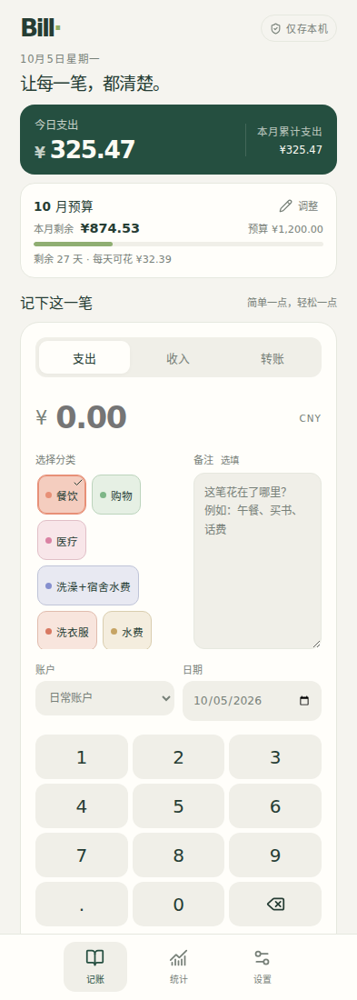
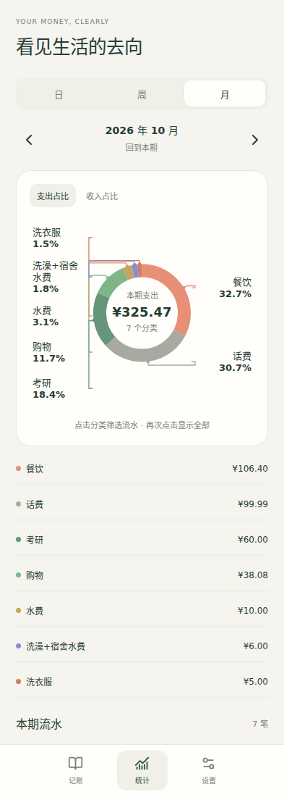
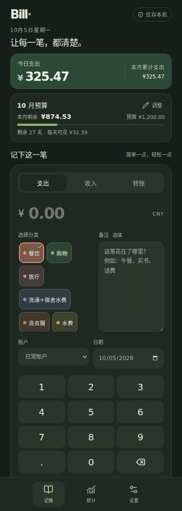

# Bill

轻量、离线、本地优先的 Android 记账应用。账户、收支、转账、预算和变更历史保存在 Android 系统 SQLite 数据库中，界面由 React 渲染。

Bill 3.0 是 Ledger 2.0.3 的架构重构。应用名称为 **Bill**，保留 `com.jizhang.repaired` 安装标识用于覆盖升级。不是把 localStorage 换个名字：数据库、领域规则、平台能力和 UI 已分层。

## 功能

- 快捷金额键盘，记录支出、收入、账户间转账；历史交易可以修正、删除。
- 账户与期初余额；分类改名、归档保留引用；金额使用整数分，当前支持人民币。
- 本月预算随支出增删改实时变化。收入和内部转账不消耗预算。
- 日、周、月、年统计；环形图配完整分类/百分比标签，点击筛选流水，不隐藏小占比。
- 修改、删除、导入和恢复与审计记录同事务提交。当前流水是可更新投影，历史审计追加写入，并以 SQLite 触发器禁止更新/删除。
- Bill JSON 完整备份、Ledger JSON 导入、导入前恢复点；CSV、Beancount 导出。
- 跟随系统深色模式、字号与减少动效；Android 系统文件选择器，不申请全盘存储权限。

## 界面预览

下图为 Bill 3.0.1 浏览器界面的示例账本截图；当前源码还支持按年统计。截图来源及更新约定见[展示截图说明](docs/screenshots/README.md)。

| 记账 | 统计 | 深色模式 |
| --- | --- | --- |
|  |  |  |

## 数据归属与升级

**正式 Android 版本**：账本位于应用私有目录 `databases/bill.db`，独立于 WebView 的网页存储。有 schema 版本、迁移、外键、事务、并发版本检查；SQLite 文件可被其他支持 SQLite 的工具读取，但应用私有目录受 Android 沙箱保护。

**浏览器开发版**：使用 IndexedDB 事务实现同一 Repository 契约，不是 Android SQLite 的模拟实机结果。清理站点数据会清空浏览器账本。网页不提供离线缓存服务，正式 Android 安装包内置所有静态资源，完全离线运行。

旧版首次覆盖升级时，从原 `https://app.local/` origin 读取 `ledger.snapshot.v2` 或 v1 分散键，校验后原子迁移。成功后只读新数据库，旧字节保留；失败显示恢复页，不自动写入空账本。仅剩旧版 `recovery` 恢复点时停止初始化，由你在恢复页明确选择恢复，不静默创建空账本。

覆盖升级必须满足：**同 applicationId + 同签名 + 更高 versionCode**。Bill 3.0.1 的 versionCode 为 301（3.0.0 为 300）。调试版使用独立标识 `com.jizhang.repaired.debug`，不能自动读取正式版旧数据。更早的 `com.jizhang.app` 是另一个应用，受系统隔离，需要从该版本导出备份后导入；改名不能绕过 Android 沙箱。

请勿卸载旧版来解决签名冲突。更改界面名称不需要更换包名。若你安装的旧版本不是这份私钥签名，应继续使用对应私钥构建。

## 开发与测试

需要 Node.js **24**、npm；Android 需要 JDK **17**、SDK Platform **35**、Build Tools **35.0.0**。Gradle **8.9** 通过已提交的 Wrapper 安装，分发包校验 SHA-256。Android 支持 7.0+，应保持系统 Android WebView 更新（依赖现代 Chromium 的 Web Crypto、structuredClone、dialog 支持）。

```bash
npm ci
npm run check
npm run dev
```

`check` 包含领域规则/真实 SQLite 测试、ESLint、TypeScript 与生产构建。

```bash
npx playwright install chromium
npm run build
npm run test:mobile
```

移动测试覆盖旧数据迁移、记录/修正/删除、预算、转账、JSON 导出/恢复、历史记录、损坏数据门禁、4 种屏宽、深色模式与放大字体。浏览器测试不等同于 Android 实机测试。

```bash
cd android
./gradlew testDebugUnitTest
```

Android 单元测试使用 Robolectric 检查真实 `BillDatabase` 的 schema、外键、事务回滚、版本冲突与审计保护。

## 一条命令构建 APK

配置好 `JAVA_HOME`、`ANDROID_HOME` 后，从项目根目录运行：

```bash
npm run android:debug
```

会执行 `npm ci`、测试、前端构建及 Gradle `assembleDebug`。输出 `android/app/build/outputs/apk/debug/app-debug.apk`。Windows 同一命令可用；Gradle 会选择 `gradlew.bat`。

正式版签名使用外部环境变量，**私钥和口令不要提交到 Git**：

```bash
export BILL_KEYSTORE=/absolute/private/path/ledger-release.jks
export BILL_STORE_PASSWORD='your-store-password'
export BILL_KEY_ALIAS='your-existing-alias'
export BILL_KEY_PASSWORD='your-key-password'
npm run android:release
```

PowerShell 使用 `$env:BILL_KEYSTORE = 'C:\private\ledger-release.jks'` 等对应变量。正式版输出 `android/app/build/outputs/apk/release/app-release.apk`。缺少签名变量时正式打包会失败，不会悄悄生成另一个签名或把调试签名当发布签名。

CI 在 push / PR 上执行测试和调试 APK 构建；手动 Release workflow 从仓库 secrets 读取 Base64 keystore 与口令，生成签名 APK artifact，**不自动创建公开 Release**。固定依赖、Wrapper 和构建版本提高可复现性，尚不承诺不同主机的 APK 达到 bit 级一致。

## 工程结构

```text
src/domain/       纯 TypeScript：实体、整数金额、规则、统计、迁移解析、交换格式
src/data/         Repository、SQLite SQL 投影、IndexedDB 事务适配
src/platform/     原生异步能力协议与文件导入导出
src/ui/           React 表单、流水、统计、设置；保存成功后才改变界面
android/          标准 Gradle 工程、原生生命周期和分离的数据库/文件/显示能力
database/         顺序 SQL 迁移（每行一条完整语句）
tests/            真实 SQLite 与移动浏览器回归测试
docs/             架构说明、测试指南和选定的展示截图
```

运行时依赖只有 React、React DOM、Lucide 图标。没有 UI 模板包、远程 CDN、统计 SDK、账号服务。App 无网络权限，原生桥只对内置本地页面开放；CSP、导航和资源请求均限制本地来源。

## 备份与会计边界

JSON 是完整恢复格式，包含当前账本和审计。导入的源审计按事件 ID 展平去重，仅保存此前未知的事件到 `sourceAudit`，不冒充本机已执行事件；旧账本作为恢复点，反复恢复可交换前后状态。CSV 是普通表格交换，Beancount 为可平衡双分录文本输出；Bill 的内部模型仍是个人收支/转账账本，不宣称完整复式会计系统。

当前数据库不做应用层加密，依赖 Android 设备/沙箱保护；导出的文件不加密。JSON 导出/导入是备份，**不是自动同步**。同步只定义了未来加密传输接口，尚未实现服务器、端到端加密、CRDT、OCR、通知识别或周期账单。

文件导入/导出上限 32 MiB；每类实体最多 100000 条。历史不会自动裁剪，每次导入仍会新增一条导入事件，但不会递归复制已有来源历史；长期大账本的分块备份和分页查询属于后续工作。卸载应用、清除应用数据或丢失设备仍可能丢失账本，建议定期导出。

## 项目文档

- [文档索引](docs/README.md)
- [架构说明](docs/architecture.md)
- [测试指南](docs/testing.md)

自动测试截图输出到 `test-results/screenshots/`，该目录不提交到 Git；`docs/screenshots/` 只保存人工选定的展示素材。

## 提交前检查

源码、测试、数据库迁移、依赖锁文件、Gradle Wrapper、GitHub Actions 配置和正式项目文档需要保留。临时开发过程记录、自动测试报告、构建产物、本机配置、账本备份和签名材料不应提交。

每次提交前运行：

```bash
git status --short
git diff --stat
git diff --cached --name-status
git diff --cached
git ls-files -ci --exclude-standard
```

先查看待提交的文件名，再查看具体改动；最后一条命令检查已被跟踪但命中忽略规则的文件，正常情况下应无输出。`.gitignore` 不会自动移除已经提交的文件。误跟踪时可用 `git rm --cached -- 文件路径` 取消跟踪并保留本机文件。

密钥或真实口令如果已经提交，必须立即撤销或更换；仅删除最新版本不能清除 Git 历史。普通开发记录的清理使用正常提交，历史提交仍可查看。
